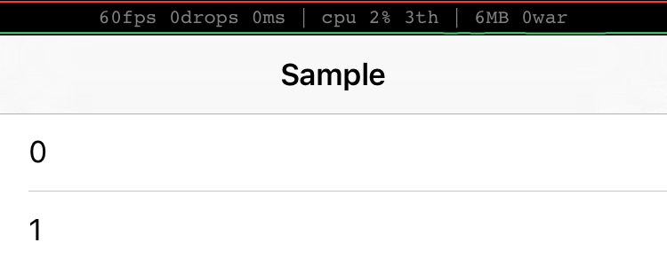

FPSStatusBar shows FPS at StatusBar

For smooth app, keep 60 frames per second !!




#### shows

- FPS
- dropped frames count
- CPU usage (this lib uses 5-10%)
- threads count
- roughly memory usage
- Warning counts
 
## Requirements

- iOS 8.0+
- Xcode 7

## Integration

#### Cocoapods

you can use Cocoapods install FPSStatusBar by adding it to your Podfile

```
pod 'FPSStatusBar', :git => 'https://github.com/asaday/FPSStatusBar.git'
```

#### Carthage

you can use Carthage install FPSStatusBar by adding it to your Cartfile

```
github "asaday/FPSStatusBar"
```

## Usage

only import and call start()

```
import FPSStatusBar

class AppDelegate: UIResponder, UIApplicationDelegate {

	var window: UIWindow?

	func application(application: UIApplication, didFinishLaunchingWithOptions launchOptions: [NSObject: AnyObject]?) -> Bool {
	
		FPSStatusBar.start()
		...

```


